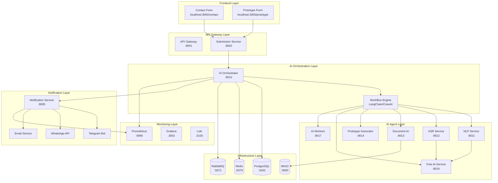
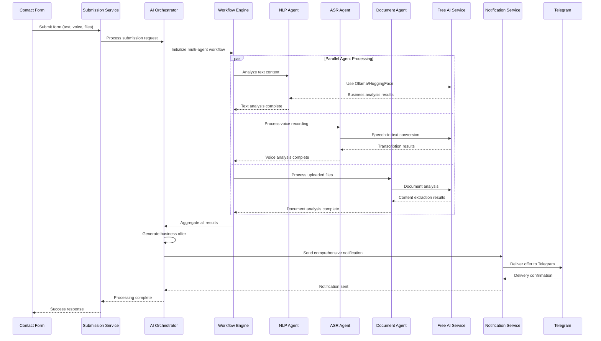

# Design Document

## Overview

This design document outlines the architecture and implementation approach for a multi-agent AI orchestration workflow that processes StateX contact form submissions. The system integrates multiple AI frameworks and workflow engines to provide intelligent business analysis through coordinated AI agents, delivering comprehensive offers to customers via Telegram notifications.

The design emphasizes the use of free AI services for development, real-time processing capabilities, and robust error handling to ensure reliable operation in a microservices environment.

## Architecture

### High-Level Architecture



### Multi-Agent Workflow Architecture



## Components and Interfaces

### 1. Contact Form Component (Frontend)

**Location:** `statex-website/frontend/src/app/contact/page.tsx`

**Responsibilities:**
- Capture user input (text, voice, files)
- Validate form data before submission
- Provide real-time feedback during processing
- Handle file uploads and voice recordings

**Key Interfaces:**
```typescript
interface ContactFormData {
  name: string;
  contactType: 'email' | 'telegram' | 'whatsapp' | 'phone';
  contactValue: string;
  description: string;
  hasRecording: boolean;
  recordingTime: number;
  files: File[];
  voiceRecording?: Blob;
}

interface FormSubmissionResponse {
  success: boolean;
  submissionId: string;
  message: string;
  estimatedProcessingTime: number;
}
```

### 2. Submission Service (Backend)

**Location:** `statex-website/services/submission-service/`
**Port:** 8002

**Responsibilities:**
- Receive and validate form submissions
- Store files in MinIO object storage
- Forward requests to AI Orchestrator
- Track submission status and progress

**Key Interfaces:**
```python
class SubmissionRequest(BaseModel):
    user_email: str
    user_name: str
    request_type: str
    description: str
    priority: str = "normal"
    files: List[UploadFile] = []
    voice_recording: Optional[UploadFile] = None

class SubmissionResponse(BaseModel):
    submission_id: str
    status: str
    message: str
    processing_started: bool
```

### 3. AI Orchestrator Service

**Location:** `statex-ai/services/ai-orchestrator/`
**Port:** 8010

**Responsibilities:**
- Coordinate multi-agent workflows
- Manage agent task distribution
- Aggregate results from multiple agents
- Generate comprehensive business offers
- Interface with workflow engines

**Key Interfaces:**
```python
class MultiAgentRequest(BaseModel):
    submission_id: str
    user_id: str
    text_content: Optional[str]
    voice_file_url: Optional[str]
    file_urls: List[str]
    contact_info: ContactInfo
    workflow_type: str = "business_analysis"

class AgentTask(BaseModel):
    task_id: str
    agent_type: str
    input_data: Dict[str, Any]
    priority: int
    timeout: int = 30

class WorkflowResult(BaseModel):
    submission_id: str
    total_agents: int
    successful_agents: int
    failed_agents: int
    processing_time: float
    business_analysis: BusinessAnalysis
    offer_details: OfferDetails
```

### 4. Workflow Engine Integration

**Framework Options:**
- **LangChain:** For agent coordination and LLM integration
- **CrewAI:** For multi-agent collaboration
- **LlamaIndex:** For document processing and RAG
- **AutoGen:** For conversational multi-agent systems

**Implementation:**
```python
class WorkflowEngine:
    def __init__(self, framework: str = "langchain"):
        self.framework = framework
        self.agents = {}
        self.workflows = {}
    
    async def execute_workflow(self, workflow_name: str, input_data: Dict) -> Dict:
        """Execute multi-agent workflow"""
        pass
    
    async def coordinate_agents(self, tasks: List[AgentTask]) -> List[AgentResult]:
        """Coordinate parallel agent execution"""
        pass
```

### 5. AI Agent Services

#### NLP Service (Port 8011)
**Responsibilities:**
- Business requirement analysis
- Market research and insights
- Technology recommendation
- Risk assessment

**Free AI Integration:**
```python
class NLPAgent:
    def __init__(self):
        self.ollama_client = OllamaClient()
        self.huggingface_client = HuggingFaceClient()
    
    async def analyze_business_requirements(self, text: str) -> BusinessAnalysis:
        # Use Ollama for local processing
        if self.ollama_client.is_available():
            return await self.ollama_client.analyze(text)
        # Fallback to HuggingFace free tier
        return await self.huggingface_client.analyze(text)
```

#### ASR Service (Port 8012)
**Responsibilities:**
- Speech-to-text conversion
- Voice content analysis
- Audio quality assessment

**Free AI Integration:**
```python
class ASRAgent:
    def __init__(self):
        self.whisper_client = WhisperClient()  # Free tier
        self.local_whisper = LocalWhisperModel()
    
    async def transcribe_audio(self, audio_file: str) -> TranscriptionResult:
        # Try local Whisper first
        if self.local_whisper.is_available():
            return await self.local_whisper.transcribe(audio_file)
        # Use OpenAI Whisper free tier
        return await self.whisper_client.transcribe(audio_file)
```

#### Document AI Service (Port 8013)
**Responsibilities:**
- Document content extraction
- OCR processing
- File format analysis
- Content summarization

**Free Tools Integration:**
```python
class DocumentAgent:
    def __init__(self):
        self.tesseract = TesseractOCR()
        self.unstructured = UnstructuredClient()
        self.local_nlp = LocalNLPModel()
    
    async def process_document(self, file_path: str) -> DocumentAnalysis:
        # Extract text using free tools
        text = await self.extract_text(file_path)
        # Analyze using local models
        return await self.local_nlp.analyze_document(text)
```

### 6. Free AI Service (Port 8016)

**Responsibilities:**
- Manage local AI models (Ollama)
- Interface with free AI APIs
- Provide cost-effective AI processing
- Handle model switching and fallbacks

**Model Management:**
```python
class FreeAIService:
    def __init__(self):
        self.ollama_models = ["llama2", "codellama", "mistral"]
        self.huggingface_models = ["microsoft/DialoGPT-medium"]
        self.local_models = {}
    
    async def get_best_model(self, task_type: str) -> str:
        """Select best available free model for task"""
        pass
    
    async def process_with_fallback(self, prompt: str, task_type: str) -> str:
        """Process with automatic fallback to available models"""
        pass
```

## Data Models

### Core Data Models

```python
class ContactSubmission(BaseModel):
    id: str
    user_name: str
    contact_type: str
    contact_value: str
    description: str
    files: List[str] = []
    voice_recording: Optional[str] = None
    created_at: datetime
    status: str = "pending"

class BusinessAnalysis(BaseModel):
    project_scope: str
    technology_stack: List[str]
    timeline_estimate: str
    budget_range: str
    risk_factors: List[str]
    market_insights: str
    recommendations: List[str]

class OfferDetails(BaseModel):
    project_id: str
    plan_url: str  # http://project-proto_{id}.localhost:3000/plan
    offer_url: str  # http://project-proto_{id}.localhost:3000/offer
    pricing_tiers: List[PricingTier]
    implementation_phases: List[Phase]
    deliverables: List[str]
    next_steps: List[str]

class AgentResult(BaseModel):
    agent_id: str
    agent_type: str
    status: str
    processing_time: float
    result_data: Dict[str, Any]
    confidence_score: float
    error_message: Optional[str] = None
```

### Workflow State Management

```python
class WorkflowState(BaseModel):
    workflow_id: str
    submission_id: str
    current_step: str
    completed_steps: List[str]
    pending_tasks: List[str]
    agent_results: Dict[str, AgentResult]
    start_time: datetime
    estimated_completion: datetime
    status: str  # "running", "completed", "failed", "paused"
```

## Error Handling

### Error Classification

```python
class ErrorType(Enum):
    VALIDATION_ERROR = "validation_error"
    AI_SERVICE_ERROR = "ai_service_error"
    NETWORK_ERROR = "network_error"
    TIMEOUT_ERROR = "timeout_error"
    RESOURCE_ERROR = "resource_error"
    WORKFLOW_ERROR = "workflow_error"

class ErrorHandler:
    def __init__(self):
        self.retry_strategies = {
            ErrorType.NETWORK_ERROR: ExponentialBackoffRetry(max_retries=3),
            ErrorType.TIMEOUT_ERROR: LinearRetry(max_retries=2),
            ErrorType.AI_SERVICE_ERROR: FallbackRetry(fallback_services=["ollama", "huggingface"])
        }
    
    async def handle_error(self, error: Exception, context: Dict) -> ErrorResponse:
        """Handle errors with appropriate retry strategy"""
        pass
```

### Graceful Degradation

```python
class GracefulDegradation:
    async def handle_agent_failure(self, failed_agent: str, workflow_state: WorkflowState):
        """Continue workflow with remaining agents"""
        if failed_agent == "nlp_agent":
            # Use basic text analysis instead of advanced NLP
            return await self.basic_text_analysis(workflow_state.input_data)
        elif failed_agent == "asr_agent":
            # Skip voice processing, continue with text and files
            return await self.skip_voice_processing(workflow_state)
```

## Testing Strategy

### Unit Testing

```python
class TestAIOrchestrator:
    async def test_workflow_execution(self):
        """Test complete workflow execution"""
        pass
    
    async def test_agent_coordination(self):
        """Test parallel agent coordination"""
        pass
    
    async def test_error_handling(self):
        """Test error handling and recovery"""
        pass

class TestFreeAIIntegration:
    async def test_ollama_integration(self):
        """Test Ollama model integration"""
        pass
    
    async def test_huggingface_fallback(self):
        """Test HuggingFace fallback mechanism"""
        pass
```

### Integration Testing

```python
class TestEndToEndWorkflow:
    async def test_contact_form_to_telegram(self):
        """Test complete workflow from form submission to Telegram notification"""
        # Submit form data
        submission = await self.submit_test_form()
        
        # Wait for AI processing
        result = await self.wait_for_processing(submission.id)
        
        # Verify Telegram notification
        notification = await self.verify_telegram_notification(submission.id)
        
        assert result.status == "completed"
        assert notification.delivered == True
```

### Performance Testing

```python
class TestPerformance:
    async def test_concurrent_submissions(self):
        """Test system performance under concurrent load"""
        tasks = []
        for i in range(10):
            task = asyncio.create_task(self.submit_test_form())
            tasks.append(task)
        
        results = await asyncio.gather(*tasks)
        
        # Verify all submissions processed within acceptable time
        for result in results:
            assert result.processing_time < 60  # seconds
```

## Deployment and Configuration

### Environment Configuration

```yaml
# .env.development
AI_MODE=free  # Use only free AI services
OLLAMA_ENABLED=true
OLLAMA_MODELS=llama2,mistral,codellama
HUGGINGFACE_API_KEY=your_free_key
OPENAI_API_KEY=  # Leave empty for development
TELEGRAM_BOT_TOKEN=your_bot_token
WORKFLOW_ENGINE=langchain
MAX_CONCURRENT_AGENTS=5
PROCESSING_TIMEOUT=60
```

### Service Dependencies

```yaml
# docker-compose.dev.yml
version: '3.8'
services:
  ai-orchestrator:
    depends_on:
      - postgres
      - redis
      - rabbitmq
      - free-ai-service
    environment:
      - AI_MODE=free
      - WORKFLOW_ENGINE=langchain
  
  free-ai-service:
    image: ollama/ollama:latest
    volumes:
      - ollama_models:/root/.ollama
    environment:
      - OLLAMA_MODELS=llama2,mistral
```

### Monitoring and Observability

```python
class WorkflowMetrics:
    def __init__(self):
        self.processing_time = Histogram('workflow_processing_time_seconds')
        self.agent_success_rate = Counter('agent_success_total')
        self.agent_failure_rate = Counter('agent_failure_total')
        self.concurrent_workflows = Gauge('concurrent_workflows')
    
    def record_workflow_completion(self, duration: float, success: bool):
        self.processing_time.observe(duration)
        if success:
            self.agent_success_rate.inc()
        else:
            self.agent_failure_rate.inc()
```

This design provides a comprehensive foundation for implementing the multi-agent AI orchestration workflow while emphasizing free AI services for development, robust error handling, and scalable architecture patterns.