# StateX Microservices Architecture Diagram

## Overview

This document provides a comprehensive visual representation of the StateX microservices architecture, including all services, ports, and their relationships.

## Architecture Diagram

```mermaid
graph TB
    %% External Users
    User[👤 User] --> Website[🌐 Website Frontend<br/>:3000]
    Admin[👨‍💼 Admin] --> Grafana[📊 Grafana<br/>:3002]
    
    %% API Gateway Layer
    Website --> APIGateway[🚪 API Gateway<br/>:8001]
    APIGateway --> Platform[🎯 Platform Management<br/>:8000]
    
    %% Core Platform Services
    Platform --> Submission[📝 Submission Service<br/>:8002]
    Platform --> UserPortal[👥 User Portal<br/>:8006]
    Platform --> Content[📄 Content Service<br/>:8009]
    
    %% AI Services Layer
    APIGateway --> AIOrchestrator[🤖 AI Orchestrator<br/>:8010]
    AIOrchestrator --> NLP[🧠 NLP Service<br/>:8011]
    AIOrchestrator --> ASR[🎤 ASR Service<br/>:8012]
    AIOrchestrator --> DocumentAI[📋 Document AI<br/>:8013]
    AIOrchestrator --> Prototype[🏗️ Prototype Generator<br/>:8014]
    AIOrchestrator --> Templates[📚 Template Repository<br/>:8015]
    AIOrchestrator --> FreeAI[🆓 Free AI Service<br/>:8016]
    AIOrchestrator --> AIWorkers[⚙️ AI Workers<br/>:8017]
    
    %% Communication Services
    APIGateway --> Notification[📧 Notification Service<br/>:8005]
    
    %% Monitoring Layer
    APIGateway --> Monitoring[📈 Monitoring Service<br/>:8007]
    APIGateway --> Logging[📝 Logging Service<br/>:8008]
    
    %% Infrastructure Layer
    subgraph Infrastructure["🏗️ Infrastructure Services"]
        PostgreSQL[(🗄️ PostgreSQL<br/>:5432)]
        Redis[(⚡ Redis<br/>:6379)]
        RabbitMQ[🐰 RabbitMQ<br/>:5672]
        MinIO[💾 MinIO<br/>:9000]
        Elasticsearch[🔍 Elasticsearch<br/>:9200]
        Ollama[🤖 Ollama<br/>:11434]
    end
    
    %% Monitoring Infrastructure
    subgraph MonitoringStack["📊 Monitoring Stack"]
        Prometheus[📊 Prometheus<br/>:9090]
        Loki[📝 Loki<br/>:3100]
        Jaeger[🔍 Jaeger<br/>:16686]
        AlertManager[🚨 AlertManager<br/>:9093]
        NodeExporter[📈 Node Exporter<br/>:9100]
        Cadvisor[📦 cAdvisor<br/>:8081]
        Blackbox[🔍 Blackbox Exporter<br/>:9115]
    end
    
    %% Reverse Proxy
    subgraph ReverseProxy["🌐 Reverse Proxy"]
        Nginx[🔄 Nginx<br/>:80, :443]
    end
    
    %% Service Connections
    Platform --> PostgreSQL
    Platform --> Redis
    Platform --> RabbitMQ
    
    Submission --> PostgreSQL
    Submission --> Redis
    Submission --> RabbitMQ
    Submission --> MinIO
    
    UserPortal --> PostgreSQL
    UserPortal --> Redis
    UserPortal --> RabbitMQ
    
    Content --> PostgreSQL
    Content --> Redis
    Content --> RabbitMQ
    Content --> MinIO
    
    AIOrchestrator --> PostgreSQL
    AIOrchestrator --> Redis
    
    NLP --> PostgreSQL
    NLP --> Redis
    
    ASR --> PostgreSQL
    ASR --> Redis
    
    DocumentAI --> PostgreSQL
    DocumentAI --> Redis
    
    Prototype --> PostgreSQL
    Prototype --> Redis
    
    Templates --> PostgreSQL
    Templates --> Redis
    
    FreeAI --> PostgreSQL
    FreeAI --> Redis
    FreeAI --> Ollama
    
    AIWorkers --> PostgreSQL
    AIWorkers --> Redis
    AIWorkers --> MinIO
    
    Notification --> PostgreSQL
    Notification --> Redis
    Notification --> RabbitMQ
    
    Monitoring --> PostgreSQL
    Monitoring --> Redis
    
    Logging --> PostgreSQL
    Logging --> Redis
    Logging --> RabbitMQ
    Logging --> Loki
    
    %% Monitoring Connections
    Prometheus --> Monitoring
    Prometheus --> NodeExporter
    Prometheus --> Cadvisor
    Prometheus --> Blackbox
    
    Grafana --> Prometheus
    Grafana --> Loki
    Grafana --> Jaeger
    
    AlertManager --> Prometheus
    
    %% External Access
    Nginx --> Website
    Nginx --> APIGateway
    
    %% Styling
    classDef userClass fill:#e1f5fe,stroke:#01579b,stroke-width:2px
    classDef serviceClass fill:#f3e5f5,stroke:#4a148c,stroke-width:2px
    classDef aiClass fill:#e8f5e8,stroke:#1b5e20,stroke-width:2px
    classDef infraClass fill:#fff3e0,stroke:#e65100,stroke-width:2px
    classDef monitoringClass fill:#fce4ec,stroke:#880e4f,stroke-width:2px
    
    class User,Admin userClass
    class Website,APIGateway,Platform,Submission,UserPortal,Content,Notification serviceClass
    class AIOrchestrator,NLP,ASR,DocumentAI,Prototype,Templates,FreeAI,AIWorkers aiClass
    class PostgreSQL,Redis,RabbitMQ,MinIO,Elasticsearch,Ollama,Nginx infraClass
    class Grafana,Prometheus,Loki,Jaeger,AlertManager,NodeExporter,Cadvisor,Blackbox,Monitoring,Logging monitoringClass
```



## Service Port Mapping

### Core Platform Services

| Service | Port | Purpose |
|---------|------|---------|
| Platform Management | 8000 | Central orchestration |
| API Gateway | 8001 | Unified API access |
| Submission Service | 8002 | Form processing |
| User Portal | 8006 | User management |
| Content Service | 8009 | Content management |

### AI Services

| Service | Port | Purpose |
|---------|------|---------|
| AI Orchestrator | 8010 | AI coordination |
| NLP Service | 8011 | Text processing |
| ASR Service | 8012 | Speech-to-text |
| Document AI | 8013 | Document processing |
| Prototype Generator | 8014 | Code generation |
| Template Repository | 8015 | Template management |
| Free AI Service | 8016 | Free AI models |
| AI Workers | 8017 | AI processing |

### Communication & Monitoring

| Service | Port | Purpose |
|---------|------|---------|
| Notification Service | 8005 | Multi-channel notifications |
| Monitoring Service | 8007 | System monitoring |
| Logging Service | 8008 | Centralized logging |

### Infrastructure Services

| Service | Port | Purpose |
|---------|------|---------|
| PostgreSQL | 5432 | Primary database |
| Redis | 6379 | Caching layer |
| RabbitMQ | 5672 | Message broker |
| MinIO | 9000 | Object storage |
| Elasticsearch | 9200 | Search engine |
| Ollama | 11434 | Local LLM |

### Monitoring Stack

| Service | Port | Purpose |
|---------|------|---------|
| Grafana | 3002 | Visualization |
| Prometheus | 9090 | Metrics collection |
| Loki | 3100 | Log aggregation |
| Jaeger | 16686 | Distributed tracing |
| AlertManager | 9093 | Alert management |
| Node Exporter | 9100 | System metrics |
| cAdvisor | 8081 | Container metrics |
| Blackbox Exporter | 9115 | Uptime monitoring |

### Frontend

| Service | Port | Purpose |
|---------|------|---------|
| Website Frontend | 3000 | Main website |

### Reverse Proxy

| Service | Port | Purpose |
|---------|------|---------|
| Nginx | 80, 443 | HTTP/HTTPS proxy |

## Data Flow

### 1. User Submission Flow

```text
User → Website Frontend → API Gateway → Platform Management → AI Orchestrator → AI Services → Notification Service → User
```

### 2. AI Processing Flow

```text
Submission → AI Orchestrator → Parallel AI Processing:
├── NLP Service (text analysis)
├── ASR Service (speech processing)
├── Document AI (file processing)
├── Free AI Service (business analysis)
└── Template Repository (template matching)
→ Results Aggregation → Notification Service
```

### 3. Monitoring Flow

```text
All Services → Prometheus → Grafana
All Services → Loki → Grafana
All Services → Jaeger → Grafana
Prometheus → AlertManager → Notification Service
```

## Network Architecture

### Docker Networks

- **statex_network**: Bridge network connecting all services
- **External access**: Services exposed on localhost ports
- **Internal communication**: Services communicate via service names

### Security

- **Rate limiting**: Implemented at API Gateway level
- **CORS**: Configured for cross-origin requests
- **Health checks**: All services have health endpoints
- **SSL/TLS**: Configured in Nginx reverse proxy

## Deployment Architecture

### Development

- All services run in Docker containers
- Single Docker network for service communication
- Local port exposure for development access

### Production

- Kubernetes deployment ready
- External load balancer
- SSL termination at reverse proxy
- Horizontal scaling support

## Management

### Centralized Management

- **manage.sh**: Unified management script
- **start_all_services.sh**: Service startup orchestration
- **stop_all_services.sh**: Service shutdown orchestration
- **docker-compose.full.yml**: Complete service definition

### Health Monitoring

- Health checks for all services
- Architecture test suite
- Prometheus metrics collection
- Grafana dashboards
- Alert management

This architecture provides a scalable, maintainable, and observable microservices platform for AI-powered business automation.
