# Architecture Diagrams

## Overview

This document contains comprehensive architecture diagrams for the Statex platform, including system architecture, data flow, service interactions, and deployment diagrams.

## System Architecture

### High-Level System Architecture

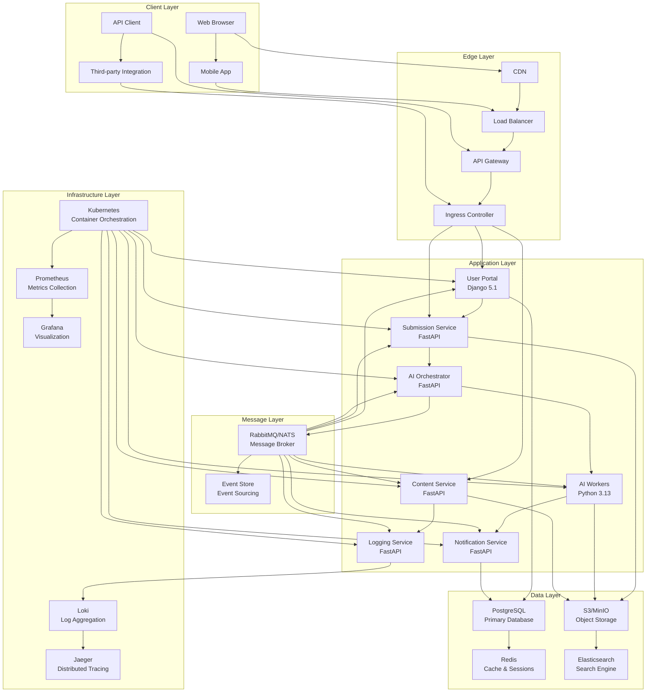
```mermaid
graph TB
    subgraph "Client Layer"
        A[Web Browser] --> B[Mobile App]
        C[API Client] --> D[Third-party Integration]
    end
    
    subgraph "Edge Layer"
        E[CDN] --> F[Load Balancer]
        F --> G[API Gateway]
        G --> H[Ingress Controller]
    end
    
    subgraph "Application Layer"
        I[User Portal<br/>Django 5.1] --> J[Submission Service<br/>FastAPI]
        J --> K[AI Orchestrator<br/>FastAPI]
        K --> L[AI Workers<br/>Python 3.13]
        L --> M[Notification Service<br/>FastAPI]
        N[Content Service<br/>FastAPI] --> O[Logging Service<br/>FastAPI]
    end
    
    subgraph "Data Layer"
        P[PostgreSQL<br/>Primary Database] --> Q[Redis<br/>Cache & Sessions]
        R[S3/MinIO<br/>Object Storage] --> S[Elasticsearch<br/>Search Engine]
    end
    
    subgraph "Infrastructure Layer"
        T[Kubernetes<br/>Container Orchestration] --> U[Prometheus<br/>Metrics Collection]
        U --> V[Grafana<br/>Visualization]
        W[Loki<br/>Log Aggregation] --> X[Jaeger<br/>Distributed Tracing]
    end
    
    subgraph "Message Layer"
        Y[RabbitMQ/NATS<br/>Message Broker] --> Z[Event Store<br/>Event Sourcing]
    end
    
    A --> E
    B --> F
    C --> G
    D --> H
    
    H --> I
    H --> J
    H --> N
    
    I --> P
    J --> R
    K --> Y
    L --> R
    M --> P
    N --> R
    O --> W
    
    T --> I
    T --> J
    T --> K
    T --> L
    T --> M
    T --> N
    T --> O
    
    Y --> I
    Y --> J
    Y --> K
    Y --> L
    Y --> M
    Y --> N
    Y --> O
```

### Microservices Architecture

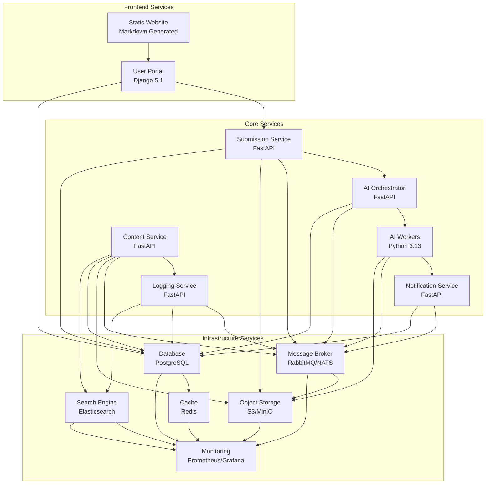
```mermaid
graph TB
    subgraph "Frontend Services"
        A[Static Website<br/>Markdown Generated] --> B[User Portal<br/>Django 5.1]
    end
    
    subgraph "Core Services"
        C[Submission Service<br/>FastAPI] --> D[AI Orchestrator<br/>FastAPI]
        D --> E[AI Workers<br/>Python 3.13]
        E --> F[Notification Service<br/>FastAPI]
        G[Content Service<br/>FastAPI] --> H[Logging Service<br/>FastAPI]
    end
    
    subgraph "Infrastructure Services"
        I[Message Broker<br/>RabbitMQ/NATS] --> J[Object Storage<br/>S3/MinIO]
        K[Database<br/>PostgreSQL] --> L[Cache<br/>Redis]
        M[Search Engine<br/>Elasticsearch] --> N[Monitoring<br/>Prometheus/Grafana]
    end
    
    B --> C
    C --> I
    D --> I
    E --> I
    F --> I
    G --> I
    H --> I
    
    C --> J
    E --> J
    G --> J
    
    B --> K
    C --> K
    D --> K
    F --> K
    G --> K
    H --> K
    
    G --> M
    H --> M
    
    I --> N
    J --> N
    K --> N
    L --> N
    M --> N
```

## Data Flow Diagrams

### User Request Processing Flow

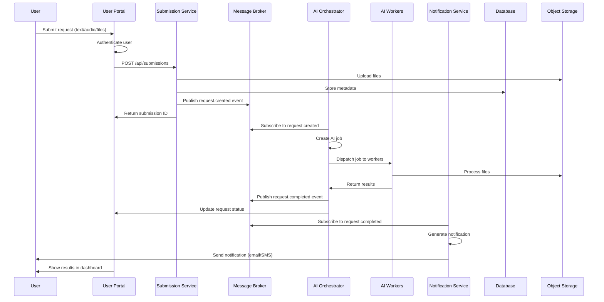
```mermaid
sequenceDiagram
    participant U as User
    participant P as User Portal
    participant S as Submission Service
    participant Q as Message Broker
    participant O as AI Orchestrator
    participant W as AI Workers
    participant N as Notification Service
    participant DB as Database
    participant S3 as Object Storage

    U->>P: Submit request (text/audio/files)
    P->>P: Authenticate user
    P->>S: POST /api/submissions
    S->>S3: Upload files
    S->>DB: Store metadata
    S->>Q: Publish request.created event
    S->>P: Return submission ID
    
    O->>Q: Subscribe to request.created
    O->>O: Create AI job
    O->>W: Dispatch job to workers
    W->>S3: Process files
    W->>O: Return results
    O->>Q: Publish request.completed event
    O->>P: Update request status
    
    N->>Q: Subscribe to request.completed
    N->>N: Generate notification
    N->>U: Send notification (email/SMS)
    
    P->>U: Show results in dashboard
```

### Content Management Flow

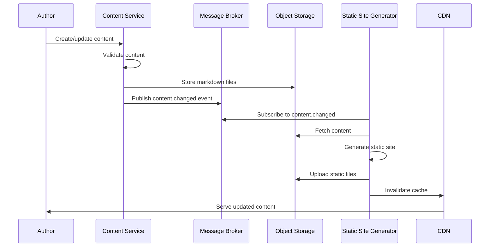
```mermaid
sequenceDiagram
    participant A as Author
    participant C as Content Service
    participant Q as Message Broker
    participant S3 as Object Storage
    participant SSG as Static Site Generator
    participant CDN as CDN

    A->>C: Create/update content
    C->>C: Validate content
    C->>S3: Store markdown files
    C->>Q: Publish content.changed event
    
    SSG->>Q: Subscribe to content.changed
    SSG->>S3: Fetch content
    SSG->>SSG: Generate static site
    SSG->>S3: Upload static files
    SSG->>CDN: Invalidate cache
    
    CDN->>A: Serve updated content
```

### Notification Processing Flow

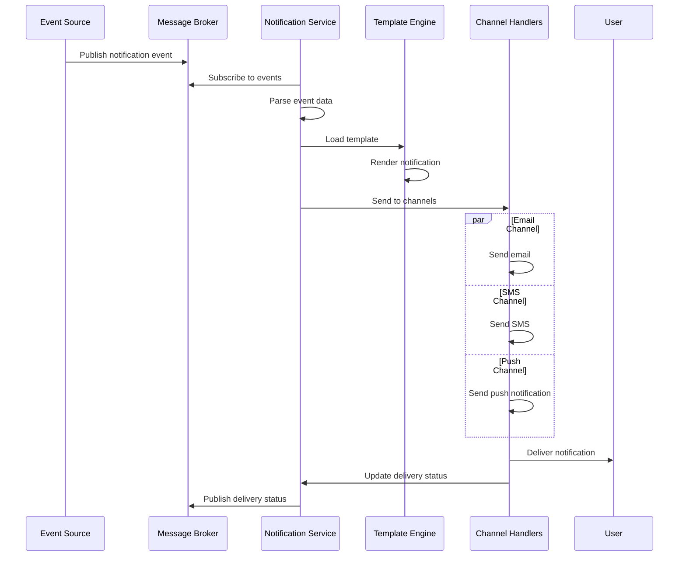
```mermaid
sequenceDiagram
    participant E as Event Source
    participant Q as Message Broker
    participant N as Notification Service
    participant T as Template Engine
    participant C as Channel Handlers
    participant U as User

    E->>Q: Publish notification event
    N->>Q: Subscribe to events
    N->>N: Parse event data
    N->>T: Load template
    T->>T: Render notification
    N->>C: Send to channels
    
    par Email Channel
        C->>C: Send email
    and SMS Channel
        C->>C: Send SMS
    and Push Channel
        C->>C: Send push notification
    end
    
    C->>U: Deliver notification
    C->>N: Update delivery status
    N->>Q: Publish delivery status
```

## Service Interaction Diagrams

### Service Dependencies

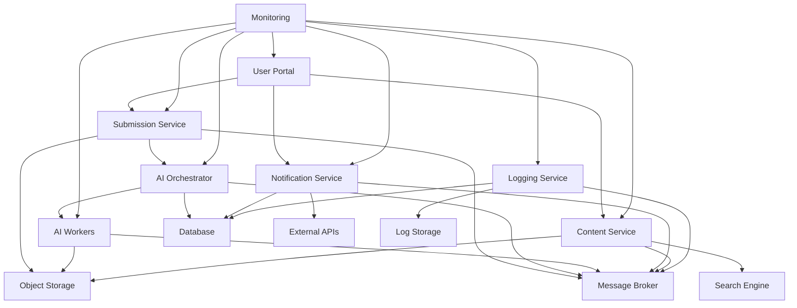
```mermaid
graph TD
    A[User Portal] --> B[Submission Service]
    A --> C[Content Service]
    A --> D[Notification Service]
    
    B --> E[AI Orchestrator]
    B --> F[Object Storage]
    B --> G[Message Broker]
    
    E --> H[AI Workers]
    E --> G
    E --> I[Database]
    
    H --> F
    H --> G
    
    D --> G
    D --> I
    D --> J[External APIs]
    
    C --> F
    C --> G
    C --> K[Search Engine]
    
    L[Logging Service] --> G
    L --> I
    L --> M[Log Storage]
    
    N[Monitoring] --> A
    N --> B
    N --> C
    N --> D
    N --> E
    N --> H
    N --> L
```

### Event Flow Architecture

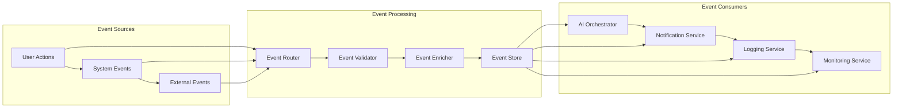
```mermaid
graph LR
    subgraph "Event Sources"
        A[User Actions] --> B[System Events]
        B --> C[External Events]
    end
    
    subgraph "Event Processing"
        D[Event Router] --> E[Event Validator]
        E --> F[Event Enricher]
        F --> G[Event Store]
    end
    
    subgraph "Event Consumers"
        H[AI Orchestrator] --> I[Notification Service]
        I --> J[Logging Service]
        J --> K[Monitoring Service]
    end
    
    A --> D
    B --> D
    C --> D
    
    G --> H
    G --> I
    G --> J
    G --> K
```

## Deployment Architecture

### Kubernetes Deployment

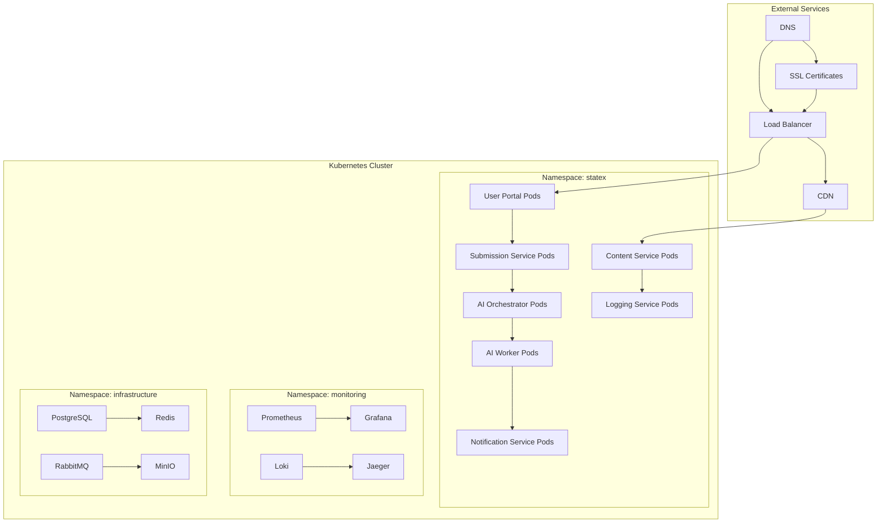
```mermaid
graph TB
    subgraph "Kubernetes Cluster"
        subgraph "Namespace: statex"
            A[User Portal Pods] --> B[Submission Service Pods]
            B --> C[AI Orchestrator Pods]
            C --> D[AI Worker Pods]
            D --> E[Notification Service Pods]
            F[Content Service Pods] --> G[Logging Service Pods]
        end
        
        subgraph "Namespace: monitoring"
            H[Prometheus] --> I[Grafana]
            J[Loki] --> K[Jaeger]
        end
        
        subgraph "Namespace: infrastructure"
            L[PostgreSQL] --> M[Redis]
            N[RabbitMQ] --> O[MinIO]
        end
    end
    
    subgraph "External Services"
        P[Load Balancer] --> Q[CDN]
        R[DNS] --> S[SSL Certificates]
    end
    
    P --> A
    Q --> F
    R --> P
    S --> P
```

### Network Architecture

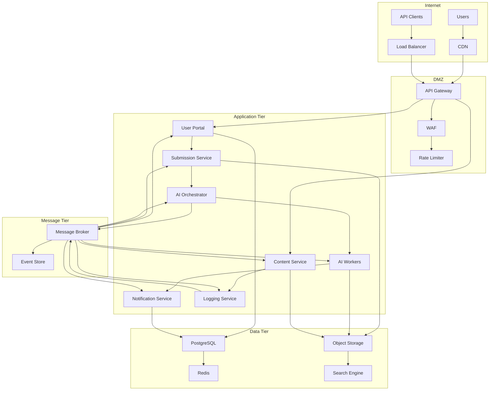
```mermaid
graph TB
    subgraph "Internet"
        A[Users] --> B[CDN]
        C[API Clients] --> D[Load Balancer]
    end
    
    subgraph "DMZ"
        E[API Gateway] --> F[WAF]
        F --> G[Rate Limiter]
    end
    
    subgraph "Application Tier"
        H[User Portal] --> I[Submission Service]
        I --> J[AI Orchestrator]
        J --> K[AI Workers]
        K --> L[Notification Service]
        M[Content Service] --> N[Logging Service]
    end
    
    subgraph "Data Tier"
        O[PostgreSQL] --> P[Redis]
        Q[Object Storage] --> R[Search Engine]
    end
    
    subgraph "Message Tier"
        S[Message Broker] --> T[Event Store]
    end
    
    B --> E
    D --> E
    E --> H
    E --> M
    
    H --> O
    I --> Q
    J --> S
    K --> Q
    L --> O
    M --> Q
    N --> S
    
    S --> H
    S --> I
    S --> J
    S --> K
    S --> L
    S --> M
    S --> N
```

## Security Architecture

### Security Layers

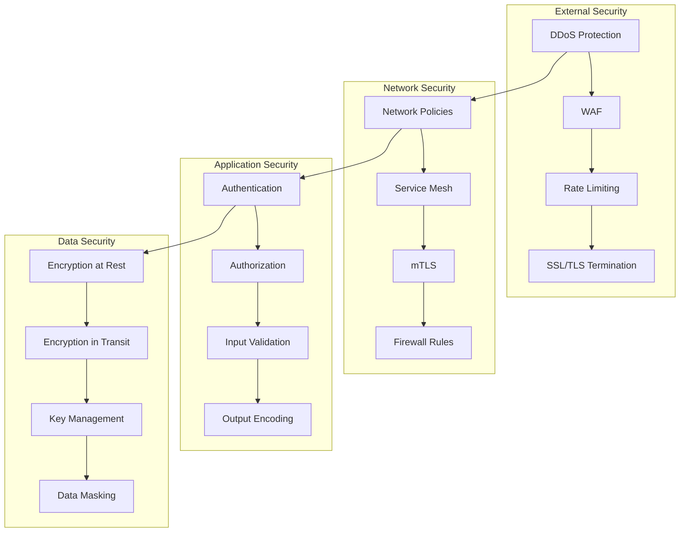
```mermaid
graph TB
    subgraph "External Security"
        A[DDoS Protection] --> B[WAF]
        B --> C[Rate Limiting]
        C --> D[SSL/TLS Termination]
    end
    
    subgraph "Network Security"
        E[Network Policies] --> F[Service Mesh]
        F --> G[mTLS]
        G --> H[Firewall Rules]
    end
    
    subgraph "Application Security"
        I[Authentication] --> J[Authorization]
        J --> K[Input Validation]
        K --> L[Output Encoding]
    end
    
    subgraph "Data Security"
        M[Encryption at Rest] --> N[Encryption in Transit]
        N --> O[Key Management]
        O --> P[Data Masking]
    end
    
    A --> E
    E --> I
    I --> M
```

### Authentication Flow

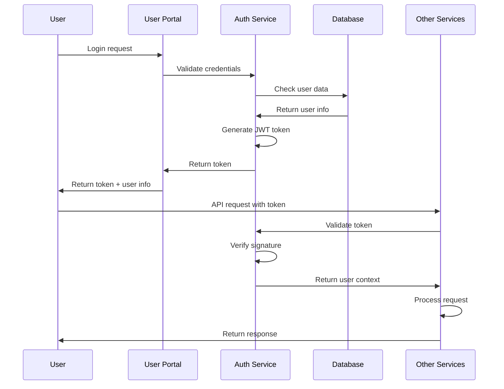
```mermaid
sequenceDiagram
    participant U as User
    participant P as User Portal
    participant A as Auth Service
    participant DB as Database
    participant S as Other Services

    U->>P: Login request
    P->>A: Validate credentials
    A->>DB: Check user data
    DB->>A: Return user info
    A->>A: Generate JWT token
    A->>P: Return token
    P->>U: Return token + user info
    
    U->>S: API request with token
    S->>A: Validate token
    A->>A: Verify signature
    A->>S: Return user context
    S->>S: Process request
    S->>U: Return response
```

## Monitoring Architecture

### Observability Stack

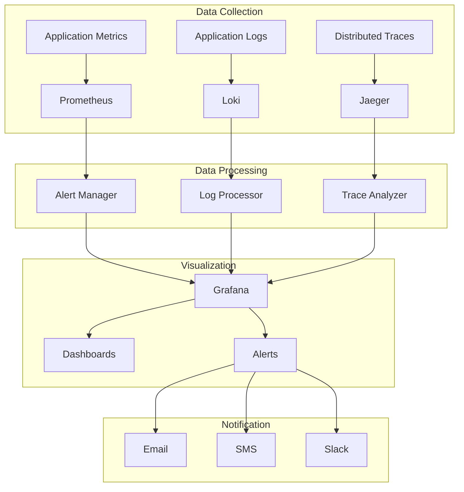
```mermaid
graph TB
    subgraph "Data Collection"
        A[Application Metrics] --> B[Prometheus]
        C[Application Logs] --> D[Loki]
        E[Distributed Traces] --> F[Jaeger]
    end
    
    subgraph "Data Processing"
        B --> G[Alert Manager]
        D --> H[Log Processor]
        F --> I[Trace Analyzer]
    end
    
    subgraph "Visualization"
        G --> J[Grafana]
        H --> J
        I --> J
        J --> K[Dashboards]
        J --> L[Alerts]
    end
    
    subgraph "Notification"
        L --> M[Email]
        L --> N[SMS]
        L --> O[Slack]
    end
```

### Metrics Flow

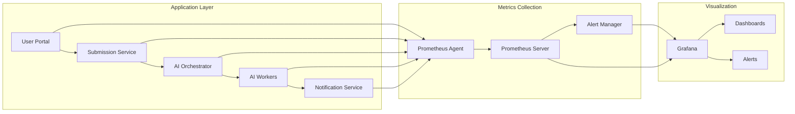
```mermaid
graph LR
    subgraph "Application Layer"
        A[User Portal] --> B[Submission Service]
        B --> C[AI Orchestrator]
        C --> D[AI Workers]
        D --> E[Notification Service]
    end
    
    subgraph "Metrics Collection"
        F[Prometheus Agent] --> G[Prometheus Server]
        G --> H[Alert Manager]
    end
    
    subgraph "Visualization"
        I[Grafana] --> J[Dashboards]
        I --> K[Alerts]
    end
    
    A --> F
    B --> F
    C --> F
    D --> F
    E --> F
    
    H --> I
    G --> I
```

## Scalability Architecture

### Horizontal Scaling

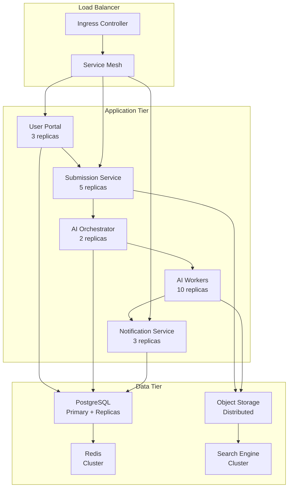
```mermaid
graph TB
    subgraph "Load Balancer"
        A[Ingress Controller] --> B[Service Mesh]
    end
    
    subgraph "Application Tier"
        C[User Portal<br/>3 replicas] --> D[Submission Service<br/>5 replicas]
        D --> E[AI Orchestrator<br/>2 replicas]
        E --> F[AI Workers<br/>10 replicas]
        F --> G[Notification Service<br/>3 replicas]
    end
    
    subgraph "Data Tier"
        H[PostgreSQL<br/>Primary + Replicas] --> I[Redis<br/>Cluster]
        J[Object Storage<br/>Distributed] --> K[Search Engine<br/>Cluster]
    end
    
    B --> C
    B --> D
    B --> G
    
    C --> H
    D --> J
    E --> H
    F --> J
    G --> H
```

### Auto-scaling Configuration

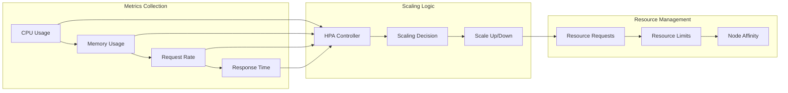
```mermaid
graph LR
    subgraph "Metrics Collection"
        A[CPU Usage] --> B[Memory Usage]
        B --> C[Request Rate]
        C --> D[Response Time]
    end
    
    subgraph "Scaling Logic"
        E[HPA Controller] --> F[Scaling Decision]
        F --> G[Scale Up/Down]
    end
    
    subgraph "Resource Management"
        H[Resource Requests] --> I[Resource Limits]
        I --> J[Node Affinity]
    end
    
    A --> E
    B --> E
    C --> E
    D --> E
    
    G --> H
```

## Disaster Recovery Architecture

### Backup Strategy

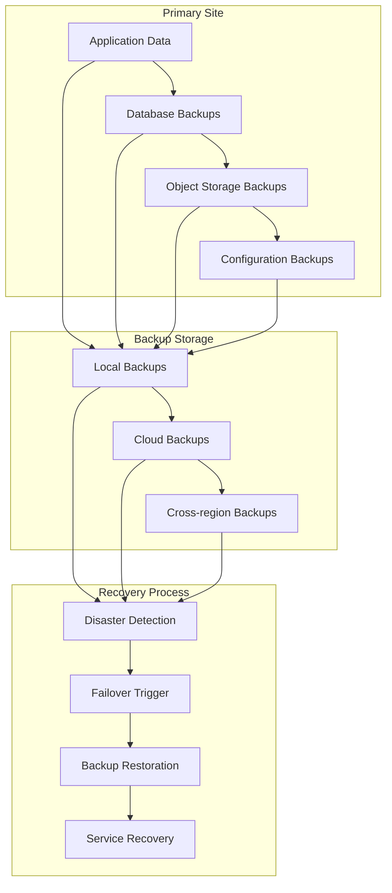
```mermaid
graph TB
    subgraph "Primary Site"
        A[Application Data] --> B[Database Backups]
        B --> C[Object Storage Backups]
        C --> D[Configuration Backups]
    end
    
    subgraph "Backup Storage"
        E[Local Backups] --> F[Cloud Backups]
        F --> G[Cross-region Backups]
    end
    
    subgraph "Recovery Process"
        H[Disaster Detection] --> I[Failover Trigger]
        I --> J[Backup Restoration]
        J --> K[Service Recovery]
    end
    
    A --> E
    B --> E
    C --> E
    D --> E
    
    E --> H
    F --> H
    G --> H
```

### Multi-Region Deployment

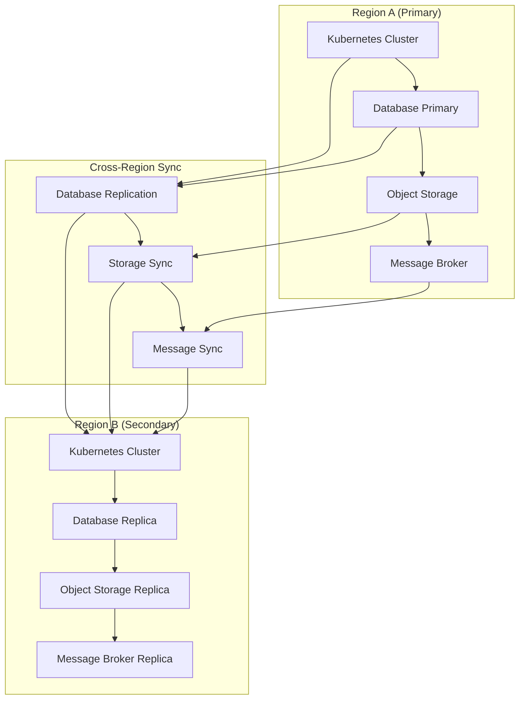
```mermaid
graph TB
    subgraph "Region A (Primary)"
        A[Kubernetes Cluster] --> B[Database Primary]
        B --> C[Object Storage]
        C --> D[Message Broker]
    end
    
    subgraph "Region B (Secondary)"
        E[Kubernetes Cluster] --> F[Database Replica]
        F --> G[Object Storage Replica]
        G --> H[Message Broker Replica]
    end
    
    subgraph "Cross-Region Sync"
        I[Database Replication] --> J[Storage Sync]
        J --> K[Message Sync]
    end
    
    A --> I
    B --> I
    C --> J
    D --> K
    
    I --> E
    J --> E
    K --> E
```

## Development Workflow

### CI/CD Pipeline

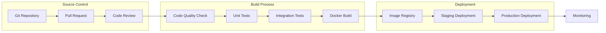
```mermaid
graph LR
    subgraph "Source Control"
        A[Git Repository] --> B[Pull Request]
        B --> C[Code Review]
    end
    
    subgraph "Build Process"
        D[Code Quality Check] --> E[Unit Tests]
        E --> F[Integration Tests]
        F --> G[Docker Build]
    end
    
    subgraph "Deployment"
        H[Image Registry] --> I[Staging Deployment]
        I --> J[Production Deployment]
    end
    
    C --> D
    G --> H
    J --> K[Monitoring]
```

### Service Development Flow

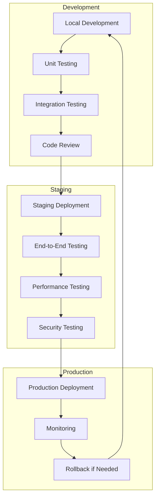
```mermaid
graph TB
    subgraph "Development"
        A[Local Development] --> B[Unit Testing]
        B --> C[Integration Testing]
        C --> D[Code Review]
    end
    
    subgraph "Staging"
        E[Staging Deployment] --> F[End-to-End Testing]
        F --> G[Performance Testing]
        G --> H[Security Testing]
    end
    
    subgraph "Production"
        I[Production Deployment] --> J[Monitoring]
        J --> K[Rollback if Needed]
    end
    
    D --> E
    H --> I
    K --> A
```

These comprehensive architecture diagrams provide a complete visual representation of the Statex platform's architecture, from high-level system design to detailed service interactions and deployment strategies.
