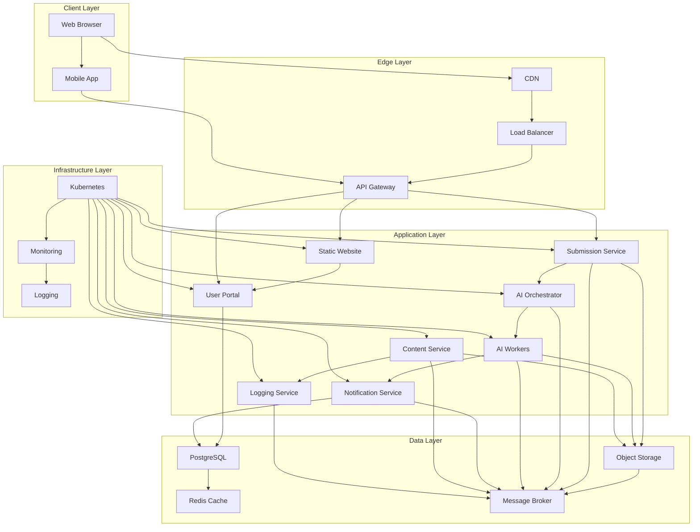
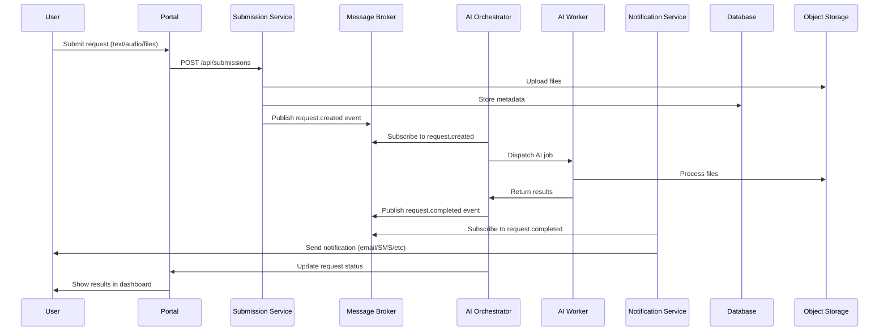

# Statex Platform Architecture

## System Overview

The Statex platform follows a microservices architecture with event-driven communication, designed for scalability, maintainability, and independent development of each component.

## Architectural Principles

### 1. Microservices Design
- **Single Responsibility**: Each service has one clear purpose
- **Independent Deployment**: Services can be deployed without affecting others
- **Technology Diversity**: Each service can use the most appropriate technology
- **Fault Isolation**: Failure in one service doesn't cascade to others

### 2. Event-Driven Architecture
- **Asynchronous Communication**: Services communicate through events
- **Loose Coupling**: Services don't need direct knowledge of each other
- **Scalability**: Easy to add new services or scale existing ones
- **Resilience**: Built-in retry and error handling mechanisms

### 3. Domain-Driven Design
- **Bounded Contexts**: Clear boundaries between different business domains
- **Ubiquitous Language**: Consistent terminology across services
- **Aggregate Roots**: Clear data ownership and consistency boundaries

## System Architecture

### High-Level Architecture

### Data Flow Architecture

## Service Communication Patterns

### 1. Synchronous Communication
- **REST APIs**: For request-response patterns
- **GraphQL**: For complex data queries
- **gRPC**: For high-performance internal communication

### 2. Asynchronous Communication
- **Event Publishing**: Services publish domain events
- **Event Subscribing**: Services subscribe to relevant events
- **Message Queues**: Reliable message delivery
- **Dead Letter Queues**: Error handling and retry mechanisms

### 3. Data Consistency
- **Eventual Consistency**: Acceptable for most use cases
- **Saga Pattern**: For complex distributed transactions
- **CQRS**: Separate read and write models where appropriate

## Technology Stack

### Backend Services
- **Python 3.13**: Primary language for all services
- **FastAPI**: High-performance API framework
- **Django 5.1**: Full-featured web framework for portal
- **Pydantic**: Data validation and serialization
- **SQLAlchemy**: Database ORM
- **Celery**: Distributed task queue

### Frontend
- **Static Site Generation**: For public content
- **Modern JavaScript**: For interactive features
- **Progressive Web App**: Mobile-friendly experience

### Infrastructure
- **Docker**: Containerization
- **Kubernetes**: Container orchestration
- **Helm**: Package management
- **NGINX**: Reverse proxy and load balancing

### Data Storage
- **PostgreSQL**: Primary database
- **Redis**: Caching and session storage
- **S3/MinIO**: Object storage
- **RabbitMQ/NATS**: Message broker

### Observability
- **OpenTelemetry**: Distributed tracing
- **Prometheus**: Metrics collection
- **Grafana**: Visualization and alerting
- **Loki**: Log aggregation
- **Jaeger**: Distributed tracing UI

## Security Architecture

### Authentication & Authorization
- **JWT Tokens**: Stateless authentication
- **OAuth 2.0**: Third-party authentication
- **RBAC**: Role-based access control
- **mTLS**: Mutual TLS for service-to-service communication

### Data Protection
- **Encryption at Rest**: Database and object storage encryption
- **Encryption in Transit**: TLS for all communications
- **PII Handling**: Special handling for personal data
- **Audit Logging**: Comprehensive audit trails

### Network Security
- **Network Policies**: Kubernetes network segmentation
- **Service Mesh**: Istio for advanced traffic management
- **WAF**: Web application firewall
- **DDoS Protection**: Rate limiting and traffic filtering

## Scalability Patterns

### Horizontal Scaling
- **Stateless Services**: Easy horizontal scaling
- **Load Balancing**: Distribute traffic across instances
- **Auto-scaling**: Kubernetes HPA and VPA
- **Database Sharding**: For large datasets

### Performance Optimization
- **Caching**: Multi-level caching strategy
- **CDN**: Global content delivery
- **Database Optimization**: Indexing and query optimization
- **Async Processing**: Non-blocking operations

## Monitoring and Observability

### Three Pillars of Observability
1. **Metrics**: Quantitative data about system performance
2. **Logs**: Detailed event records
3. **Traces**: Request flow through distributed systems

### Key Metrics
- **Business Metrics**: User requests, AI processing time, notification delivery
- **Technical Metrics**: Response times, error rates, resource utilization
- **Infrastructure Metrics**: CPU, memory, disk, network usage

### Alerting Strategy
- **Critical Alerts**: System down, data loss, security breaches
- **Warning Alerts**: Performance degradation, resource constraints
- **Info Alerts**: Deployment notifications, capacity planning

## Disaster Recovery

### Backup Strategy
- **Database Backups**: Daily automated backups
- **Object Storage**: Cross-region replication
- **Configuration**: Infrastructure as Code versioning
- **Code**: Git repository backups

### Recovery Procedures
- **RTO (Recovery Time Objective)**: < 1 hour for critical services
- **RPO (Recovery Point Objective)**: < 15 minutes data loss
- **Failover**: Automated failover to backup regions
- **Testing**: Regular disaster recovery drills

## Development Workflow

### Git Strategy
- **Feature Branches**: Each feature in separate branch
- **Pull Requests**: Code review and CI/CD triggers
- **Semantic Versioning**: Clear version numbering
- **Release Tags**: Marked releases for rollback capability

### CI/CD Pipeline
1. **Code Quality**: Linting, formatting, security scanning
2. **Testing**: Unit, integration, and end-to-end tests
3. **Building**: Docker image creation
4. **Deployment**: Automated deployment to environments
5. **Monitoring**: Post-deployment health checks

### Environment Strategy
- **Development**: Local development environment
- **Staging**: Pre-production testing environment
- **Production**: Live production environment
- **Feature Environments**: Per-feature testing environments

## Future Considerations

### Planned Enhancements
- **Service Mesh**: Istio for advanced traffic management
- **Multi-region**: Global deployment for low latency
- **AI Model Management**: MLOps for AI model lifecycle
- **Advanced Analytics**: Business intelligence and reporting

### Technology Evolution
- **Cloud Native**: Full cloud-native architecture
- **Serverless**: Function-as-a-Service for specific workloads
- **Edge Computing**: Processing closer to users
- **Quantum Computing**: Future-proofing for quantum algorithms
