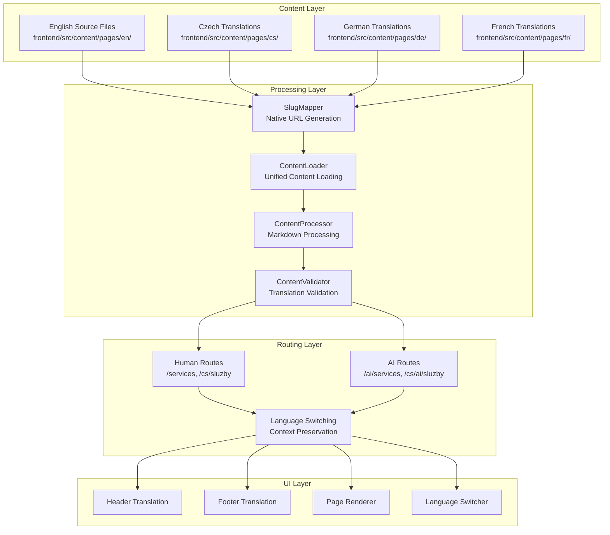

# Complete Multilingual Translation System - Design Document

## Overview

The Complete Multilingual Translation System builds upon the existing partial implementation to provide comprehensive multilingual support across the entire Statex website. The system leverages the successful blog translation architecture and extends it to all content types, ensuring consistent user experience and AI-friendly content serving.

**Core Principle: English Markdown as Single Source of Truth**

All website content (pages, blog articles, services, solutions, legal documents) originates from English markdown files, which serve as the authoritative source. These English markdown files are then translated into all supported languages (Czech, German, French), maintaining the same structure and metadata.

**Dual Content Serving Strategy:**

1. **AI-Friendly Version:** Raw markdown files are served directly to AI crawlers and agents via dedicated `/ai/` routes, enabling faster indexing and better SEO performance. This allows AI systems to quickly parse structured content without HTML overhead.

2. **Human-Readable Version:** Markdown content is processed and rendered as HTML with full styling, navigation, and interactive elements for human users via standard routes.

This approach ensures optimal performance for both AI indexing (faster crawling, better SEO) and human experience (rich formatting, interactive elements).

## Architecture

### Current State Analysis

**Strengths of Existing System:**
- Blog system fully implemented with 48 markdown files (12 posts × 4 languages)
- Sophisticated SlugMapper with native language URL support
- ContentLoader with caching and multilingual content loading
- Translation system for header/footer components
- AI-friendly content serving for blog posts
- Language detection and switching functionality

**Gaps to Address:**
- Incomplete page translations (missing ~100 markdown files)
- Inconsistent URL patterns between blog and pages
- Missing translations for services, solutions, and legal content
- Incomplete AI content serving for non-blog pages
- Missing translation validation and consistency checks

### Target Architecture



## Components and Interfaces

### 1. Enhanced ContentLoader Interface

```typescript
interface UnifiedContentLoader {
  // Core content loading
  loadContent(contentType: ContentType, slug: string, language: string): Promise<ProcessedContent | null>;
  loadAllContent(contentType: ContentType, language: string): Promise<ProcessedContent[]>;
  
  // Translation management
  getAvailableLanguages(englishSlug: string, contentType: ContentType): Promise<string[]>;
  validateTranslations(englishSlug: string, contentType: ContentType): Promise<ValidationResult>;
  
  // URL generation
  generateUrl(englishSlug: string, language: string, contentType: ContentType): string;
  generateAIUrl(englishSlug: string, language: string, contentType: ContentType): string;
  
  // Language detection
  detectLanguageFromSlug(slug: string, contentType: ContentType): string;
  getNativeSlug(englishSlug: string, language: string): string;
  getEnglishSlug(nativeSlug: string, language: string): string | null;
}

type ContentType = 'blog' | 'pages' | 'services' | 'solutions' | 'legal';
```

### 2. Translation Validation System

```typescript
interface ContentValidator {
  validateAllTranslations(): Promise<ValidationReport>;
  validateContentType(contentType: ContentType): Promise<ValidationResult[]>;
  validateSingleContent(englishSlug: string, contentType: ContentType): Promise<ValidationResult>;
  generateMissingTranslationReport(): Promise<MissingTranslationReport>;
}

interface ValidationResult {
  englishSlug: string;
  contentType: ContentType;
  missingLanguages: string[];
  outdatedTranslations: string[];
  structuralInconsistencies: string[];
  isValid: boolean;
}
```

### 3. Enhanced SlugMapper

```typescript
interface EnhancedSlugMapper {
  // Existing functionality
  getNativeSlug(englishSlug: string, language: string): string;
  getEnglishSlug(nativeSlug: string, language: string): string | null;
  
  // New functionality
  addSlugMapping(englishSlug: string, mappings: SlugMapping): void;
  validateSlugMappings(): ValidationResult[];
  generateSlugMappingsFromContent(): Promise<SlugMapping[]>;
  exportSlugMappings(): string;
  importSlugMappings(mappings: string): void;
}
```

### 4. Unified Translation Service

```typescript
interface TranslationService {
  // Component translations
  getHeaderTranslation(language: string): HeaderTranslation;
  getFooterTranslation(language: string): FooterTranslation;
  getCommonTranslation(language: string): CommonTranslation;
  
  // Content translations
  getContentTranslation(key: string, language: string): string;
  getAllTranslations(language: string): Record<string, string>;
  
  // Translation management
  addTranslation(key: string, translations: Record<string, string>): void;
  validateTranslations(): ValidationResult[];
}
```

## Data Models

### 1. Enhanced Content Structure

```typescript
interface ProcessedContent {
  markdown: {
    frontmatter: {
      title: string;
      description: string;
      publishDate: string;
      category: string;
      tags: string[];
      seo: {
        metaDescription: string;
        keywords: string[];
        canonicalUrl?: string;
      };
      translations: {
        [language: string]: {
          title: string;
          description: string;
          slug: string;
          lastUpdated: string;
        };
      };
    };
    content: string;
    metadata: {
      slug: string;
      language: string;
      contentType: ContentType;
      wordCount: number;
      readTime: string;
      lastModified: string;
    };
  };
  html: string;
  toc: TableOfContents[];
  relatedContent: ProcessedContent[];
}
```

### 2. Translation Metadata

```typescript
interface TranslationMetadata {
  sourceLanguage: 'en';
  targetLanguages: string[];
  lastUpdated: Record<string, string>;
  translationStatus: Record<string, TranslationStatus>;
  contentHash: Record<string, string>;
  translationQuality: Record<string, QualityScore>;
}

type TranslationStatus = 'missing' | 'outdated' | 'current' | 'review_needed';
type QualityScore = 'excellent' | 'good' | 'needs_improvement' | 'poor';
```

### 3. Content File Structure

**English as Single Source of Truth:**
All content originates from English markdown files in `frontend/src/content/`. These files contain the authoritative content structure, metadata, and information that gets translated into all supported languages.

```
frontend/src/content/
├── blog/                    # Existing blog structure (complete)
│   ├── en/                  # 12 English source blog posts (SINGLE SOURCE OF TRUTH)
│   ├── cs/                  # 12 Czech translations (derived from EN)
│   ├── de/                  # 12 German translations (derived from EN)
│   └── fr/                  # 12 French translations (derived from EN)
├── pages/                   # Enhanced page structure
│   ├── en/                  # English source files (SINGLE SOURCE OF TRUTH)
│   │   ├── home.md          # Homepage content source
│   │   ├── about.md         # About page content source
│   │   ├── contact.md       # Contact page content source
│   │   ├── services/        # 11 service files (authoritative)
│   │   ├── solutions/       # 10 solution files (authoritative)
│   │   └── legal/           # 13 legal files (authoritative)
│   ├── cs/                  # Czech translations (31 files derived from EN)
│   ├── de/                  # German translations (31 files derived from EN)
│   └── fr/                  # French translations (31 files derived from EN)
└── translations/            # Component translations
    ├── header.ts
    ├── footer.ts
    └── common.ts
```

**Content Serving Strategy:**

1. **AI Routes (Raw Markdown):**
   - `/ai/services/digital-transformation` → Serves raw English markdown
   - `/cs/ai/sluzby/digitalni-transformace` → Serves raw Czech markdown
   - Optimized for AI crawlers and agents for faster indexing and better SEO

2. **Human Routes (Processed HTML):**
   - `/services/digital-transformation` → Renders English HTML with full styling
   - `/cs/sluzby/digitalni-transformace` → Renders Czech HTML with full styling
   - Optimized for human readers with rich formatting and interactivity

## Error Handling

### 1. Missing Translation Fallbacks

```typescript
interface FallbackStrategy {
  handleMissingTranslation(
    englishSlug: string, 
    language: string, 
    contentType: ContentType
  ): Promise<FallbackResult>;
  
  handleMissingPage(
    slug: string, 
    language: string
  ): Promise<RedirectResult>;
  
  handleLanguageSwitchError(
    currentSlug: string, 
    targetLanguage: string
  ): Promise<AlternativeResult>;
}

interface FallbackResult {
  content: ProcessedContent;
  fallbackUsed: boolean;
  fallbackReason: string;
  suggestedAlternatives: ProcessedContent[];
}
```

### 2. Content Validation Errors

```typescript
interface ValidationErrorHandler {
  handleStructuralMismatch(
    englishContent: ProcessedContent,
    translatedContent: ProcessedContent
  ): ValidationError[];
  
  handleMissingFrontmatter(
    content: ProcessedContent,
    requiredFields: string[]
  ): ValidationError[];
  
  handleInvalidSlugMapping(
    englishSlug: string,
    nativeSlug: string,
    language: string
  ): ValidationError;
}
```

### 3. Performance Error Handling

```typescript
interface PerformanceErrorHandler {
  handleCacheFailure(cacheKey: string): Promise<ProcessedContent>;
  handleSlowContentLoading(contentType: ContentType): Promise<void>;
  handleMemoryPressure(): Promise<void>;
}
```

## Testing Strategy

### 1. Unit Testing

**Content Loading Tests:**
- Test ContentLoader for all content types and languages
- Test SlugMapper for accurate native slug generation
- Test ContentProcessor for consistent markdown processing
- Test TranslationService for complete translation coverage

**Validation Tests:**
- Test ContentValidator for missing translations detection
- Test structural consistency validation
- Test frontmatter validation across languages
- Test URL generation accuracy

### 2. Integration Testing

**End-to-End Translation Flow:**
- Test complete content creation and translation workflow
- Test language switching with context preservation
- Test AI content serving for all content types
- Test SEO metadata generation for all languages

**Routing Tests:**
- Test all URL patterns for human and AI access
- Test language detection from URLs
- Test redirect behavior for missing content
- Test canonical URL generation

### 3. Performance Testing

**Load Testing:**
- Test content loading performance with full translation set
- Test cache effectiveness across languages
- Test memory usage with complete content set
- Test concurrent language switching

**Scalability Testing:**
- Test system behavior with additional languages
- Test content loading with large content sets
- Test search and filtering across languages

### 4. User Experience Testing

**Language Switching:**
- Test seamless language switching on all page types
- Test context preservation during language changes
- Test fallback behavior for missing translations
- Test user feedback for translation issues

**Content Consistency:**
- Test visual consistency across languages
- Test navigation consistency in all languages
- Test form functionality in all languages
- Test error message translations

## Implementation Phases

### Phase 1: Content Creation and Translation (Week 1-2)
1. Create missing English source files (services, solutions, legal)
2. Generate complete translations for Czech, German, French
3. Update SlugMapper with all new slug mappings
4. Validate content structure consistency

### Phase 2: System Integration (Week 3)
1. Enhance ContentLoader for unified content loading
2. Implement ContentValidator for translation validation
3. Update routing system for consistent URL patterns
4. Integrate AI content serving for all content types

### Phase 3: UI and UX Enhancement (Week 4)
1. Complete header and footer translation integration
2. Enhance language switching functionality
3. Implement translation status indicators
4. Add content validation dashboard

### Phase 4: Testing and Optimization (Week 5)
1. Comprehensive testing across all content types
2. Performance optimization and caching improvements
3. SEO validation and metadata enhancement
4. User acceptance testing and feedback integration

## Success Metrics

### Content Coverage
- **Target:** 160 markdown files (40 pages × 4 languages)
- **Current:** 60 files (48 blog + 12 pages)
- **Gap:** 100 additional files needed

### Translation Completeness
- **Target:** 100% translation coverage for all content types
- **Validation:** Automated validation reports
- **Quality:** Manual review for accuracy and consistency

### Performance Metrics
- **Page Load Time:** <2 seconds for all languages
- **Language Switch Time:** <500ms
- **Cache Hit Rate:** >90% for translated content
- **SEO Score:** >95 for all language versions

### User Experience Metrics
- **Language Switch Success Rate:** >99%
- **Content Consistency Score:** >95%
- **User Satisfaction:** >4.5/5 for multilingual experience
- **Bounce Rate:** <30% for non-English pages